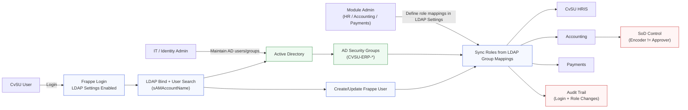

# CvSU LDAP Integration Use Case Diagram

This diagram shows AD/LDAP authentication at Frappe core and authorization via LDAP group to Frappe role mapping for `cvsu_hris`, `accounting`, and `payments`.

## Role Mapping Reference (Pilot)

- `CVSU-ERP-HRIS-EMPLOYEE` -> `Employee`
- `CVSU-ERP-HRIS-OFFICER` -> `HR User`
- `CVSU-ERP-HRIS-MANAGER` -> `HR Manager`
- `CVSU-ERP-ACCT-ENCODER` -> `Accounts User`
- `CVSU-ERP-ACCT-APPROVER` -> `Accounts Manager`
- `CVSU-ERP-PAYMENTS-ADMIN` -> `System Manager`

## Primary Use Cases

1. User logs in once via AD credentials and gains app access based on mapped roles.
2. Onboarding/offboarding happens by adding/removing AD group membership.
3. Accounting segregation of duties is enforced through distinct AD groups.
4. Payment operations remain role-gated and auditable via centralized identity.
