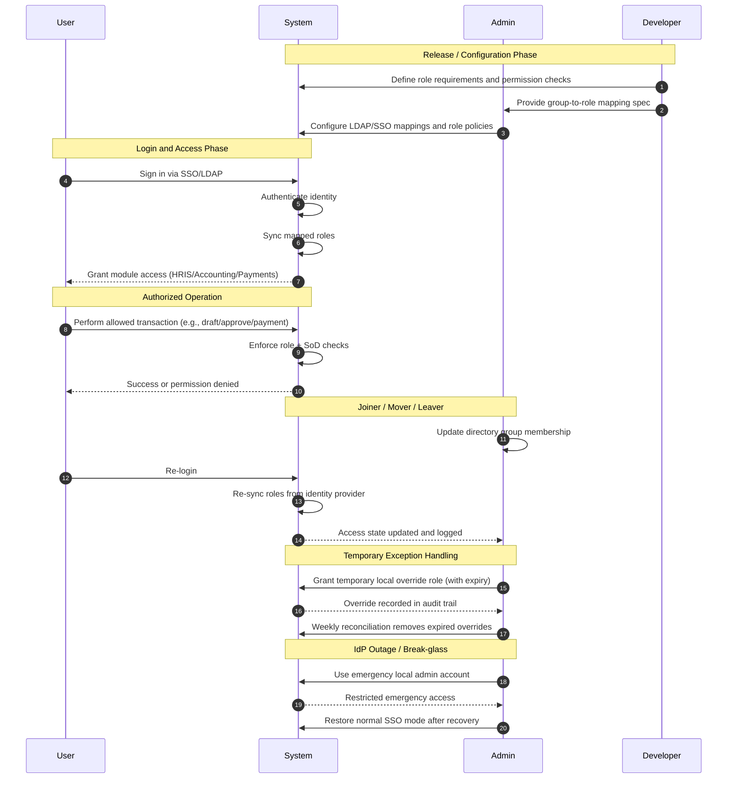

# Hybrid Access Swimlane Diagram

```mermaid
sequenceDiagram
    autonumber
    participant User
    participant System
    participant Admin
    participant Developer

    Note over Developer,System: Release / Configuration Phase
    Developer->>System: Define role requirements and permission checks
    Developer->>Admin: Provide group-to-role mapping spec
    Admin->>System: Configure LDAP/SSO mappings and role policies

    Note over User,System: Login and Access Phase
    User->>System: Sign in via SSO/LDAP
    System->>System: Authenticate identity
    System->>System: Sync mapped roles
    System-->>User: Grant module access (HRIS/Accounting/Payments)

    Note over User,System: Authorized Operation
    User->>System: Perform allowed transaction (e.g., draft/approve/payment)
    System->>System: Enforce role + SoD checks
    System-->>User: Success or permission denied

    Note over Admin,System: Joiner / Mover / Leaver
    Admin->>Admin: Update directory group membership
    User->>System: Re-login
    System->>System: Re-sync roles from identity provider
    System-->>Admin: Access state updated and logged

    Note over Admin,System: Temporary Exception Handling
    Admin->>System: Grant temporary local override role (with expiry)
    System-->>Admin: Override recorded in audit trail
    Admin->>System: Weekly reconciliation removes expired overrides

    Note over Admin,System: IdP Outage / Break-glass
    Admin->>System: Use emergency local admin account
    System-->>Admin: Restricted emergency access
    Admin->>System: Restore normal SSO mode after recovery
```
